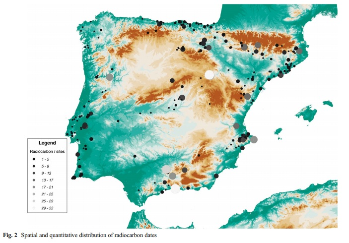

#Preliminaries
You will need to install and launch the fallowing packages: [stringr](https://cran.r-project.org/web/packages/stringr/stringr.pdf), [knitr](https://cran.r-project.org/web/packages/knitr/knitr.pdf), [ggplot2](https://cran.r-project.org/web/packages/ggplot2/ggplot2.pdf), [ggmap](https://cran.r-project.org/web/packages/ggmap/ggmap.pdf), and [Bchron](https://cran.r-project.org/web/packages/Bchron/Bchron.pdf).  You will also needd to read Oreto García Puchol, Agustín Diez Castillo, and Salvador Pardo-Gordó's paper [“New insights into the neolithisation process in southwest Europe according to spatial density analysis from calibrated radiocarbon dates”](https://link.springer.com/article/10.1007%2Fs12520-017-0498-1#SupplementaryMaterial), and load that into R using the [curl](https://cran.r-project.org/web/packages/curl/curl.pdf) command and import the data from [Puchol et al (2017) edited data.csv](https://github.com/andym5780/data-reanalysis-assignment/blob/master/Puchol%20et%20al%20(2017)%20edited%20data.csv) and [sites_iberian_peninsula_jaa.kmz](https://github.com/andym5780/data-reanalysis-assignment/blob/master/sites_iberian_peninsula_jaa.kmz).

All these packages should be launched
```{r}
library(stringr)
library(Bchron)
library(knitr)
library(ggplot2)
library(ggmap)
library(curl)
```

#Paper Background

In Puchol et al’s 2017 article “New insights into the neolithisation process in southwest Europe according to spatial density analysis from calibrated radiocarbon dates,” their goal is to map the neolithisation, the transition from the Late Mesolithic to the Early Neolithic, of the Iberian Peninsula by looking at sites associated with the earliest Neolithic processes such the introduction of regular blade knapping technology, and radiocarbon dates from each site. They compiled a database with all of the known sites and radiocarbon dates in the peninsula that are within range of 8000 BP to 5500 BP.

After collecting all the data points, Puchol et al (2017) had a total of 1276 uncalibrated radiocarbon dates, they then filtered out any dates which could have been affected by the reservoir effect, or any dates which had a standard deviation of 150 years. This left them with 834 uncalibrated radiocarbon dates with a standard deviation of 59.9. They then calibrated these dates with the Bchron package in R using the IntCal13 calibration curve. Next, they binned the radiocarbon dates in groups of 200-year intervals. After that the bins were normalized and the values were fit to a smoothed Gaussian isotropic kernel using the density.ppp command from the R package spatstat. Finally, Puchol et al (2017) used the raster package and the rasterVis package to produce maps of the special and quantitative distribution of radiocarbon dates along with chronological maps representing density of radiocarbon dates.

Puchol et al (2017) discuss their paper findings by stating that through their analyses, it becomes evident that when mapping the neolithisation of Iberia a general east/west route can be suggested. There is also a gradual increase of radiocarbon dates in association with Neolithic dates starting around 7000 cal BC. Their maps also show that there seems to be some significant importance between the Mediterranean coastline and the expansion of Neolithic technology. Puchol et al Concludes the paper by suggesting that this map can help create an open debate between whether the neolithisation of Iberian was from demic diffusion, cultural diffusion, or a combination of the two.

#My Reanalyses


For my reanalyses of Puchol et al (2017), I will first calculate the average standard deviation from the dataset they provide. In this article Puchol et al (2017) use 864 dates, but only provide 165 to the reader. Because if this, I will calculate the standard deviation and use an F-test to see if there is a significant difference between the stander deviation I calculate from the 165 dates compared to the 864 dates. Next, I will recreate Puchol et al’s (2017) spatial and quantitative distribution of radiocarbon dates map. Finaly, I will use calibrate the radiocarbon dates using the Bchron package which will let me calibrate the 165 radiocarbon data using the intcal13 calibration curve.

#Imported Database

While I was importing the dataset into R, I noticed that the original dataset (labeled” Puchol et al (2017) original data.csv” on my GitHub data-reanalysis-assignment repository) was missing the Latitude and Longitude components for each site. These values were located in a Google Earth kmz file under supplementary materials on the original paper. I uploaded this Google Earth file to my repository and named it “sites_iberian_peninsula_jaa.kmz.” I tried to figure out a way to input the Latitude and Longitude from Google Earth directly into R, I could not and had to instead import them into the “Puchol et al (2017) original data.csv.” I then saved this as a new csv file titled “Puchol et al (2017) edited data.csv” and uploaded it to GitHub. This is the cvs file I used for the entire project.

```{r}
f <- curl("https://raw.githubusercontent.com/andym5780/data-reanalysis-assignment/master/Puchol%20et%20al%20(2017)%20edited%20data.csv")
orig <- read.csv(f, header = TRUE)
head(orig)
```

Here I have brought in the edited database used by Pulchol et al (2017). They have only provided 165 dates despite the fact that they did these calculation with 834 dates because of this, there might  be differenced in my results compared to theirs. 

#1 Testing Significant Differences in the Standard Deviations
Bellow I will test to see if there is a significant difference in the average standard deviations of the original dataset with 834 site and the average standard deviation found in this dataset with 165 dates. I will do this by using an F-test regarding two population standard deviations. I will us a right tailed test to see if the difference is significant because it would seem like if these values are different, then the standard deviation for sd1, which comes from the 834 dates, would be larger. Here my null hypothesis is sd1=sd2, and my alternative hypothesis is sd1>sd2 where sd1 comes from the 834 dates and sd2 comes from the 165 dates.

The first standard deviation, sd1, comes from within Pulchol et al (2017). They state that the average standard deviation is 59.9 so

```{r}
sd1 <- 59.9
```

Next, I will calculate the average standard deviation from the 165 dates.

```{r}
x <- sum(orig$SD)
sd2 <-x/165
sd2
```

So the average standard deviation from 165 dates is 43.25455. Next I will conduct the F-test.

```{r}
Fo <- sd1/sd2
Fo
```

Here our Fo test statistic is 1.384826. In order to test whether or not I should reject our null hypothesis we must see if this Fo is greater than our test statistic. Next we will calculate our critical value at a 95% confidence level, with the degrees of freedom being 833 for df1 and 164 for df2 so

```{r}
df1 <- 833
df2 <- 164
cv <- qf(.95, df1=df1, df2=df2)
cv
```

Here the Fo is greater than cv, so we reject the null hypothesis and say that there is significant evidence to suggest that average standard deviation for the 834 dates is greater than the 165 dates at the alpha equals 0.05 level of significant, and that this can cause there to be a difference in results compared to the original paper.


#2 Spatial and Quantitative Distribution of Radiocarbon Dates Map 

##My Spatial and Quantitative Distribution of Radiocarbon Dates Map 

In this part of the project I will attempted to recreate Puchol et al's (2017) spatial and quantitative distribution of radiocarbon dates map. Instead of using the [raster](https://cran.r-project.org/web/packages/raster/vignettes/Raster.pdf) and the [rasterVis](https://cran.r-project.org/web/packages/rasterVis/rasterVis.pdf) packages like they did, I will use the [ggplot2](https://cran.r-project.org/web/packages/ggplot2/ggplot2.pdf) and [ggmap](https://cran.r-project.org/web/packages/ggmap/ggmap.pdf). I chose to use the packages instead of the ones used by Puchol et al (2017) because the ggmap package does not require one to download a shapefile and then load it into R markdown, and because the shapefile I found that appeared to be the same as the one used by Puchol et al (2017) required me to purchase it. I tried using a similar, free to download shape file first, but it resulted in an error when I uploaded the shapefile to GitHub and then tried to use the curl command to input it into R markdown. The ggmap package uses the information from Google Maps to create maps and therefore does not require a shapefile to be downloaded.

```{r}
size <- make_bbox(lon = orig$Longitude, lat = orig$Latitude, f = .1)
```

Here I have set the parameters for how large my map will be by using the latitude and longitude from the orig dataframe. This command will make sure that the map is an appropriate size and will not produce something too large or too small. 

```{r}
sq_map <- get_map(location = size, maptype = "satellite", source = "google")
```

Here the get_map command generates will retrieve a map, in this case from Google Maps because I told it to by setting source equal to “google”, and it will be a hybrid between a satellite map and a terrain map. The map will be fitted to the dimensions specified with the make_bbox command

```{r}
ggmap(sq_map) + geom_point(data = orig, mapping = aes(x = orig$Longitude, y = orig$Latitude))
```

Here I have imported the map of the Iberian Peninsula and added the sites where the 165 radiocarbon dates were sampled from. As one can see there are not 165 individual sites because some site have multiple dates. The dataset that Puchol et al (2017) gave contains only 49 site, while their paper indicates they used 239 when conducting their study. This difference in site size may cause the spatial and quantitative distribution of radiocarbon dates map to look slightly different. 

```{r}
RadiocarbonDatesPerSites <- orig$Radiocarbon.sites

ggmap(sq_map) + geom_point(data = orig, mapping = aes(x = orig$Longitude, y = orig$Latitude, color = RadiocarbonDatesPerSites, size = RadiocarbonDatesPerSites))
```

Above is my version of the spatial and quantitative distribution of radiocarbon dates map. I set the column orig$Radiocarbon.sites equal to the variable RadiocarbonDatesPerSites so that this title would appear in the legend. By setting both color and size equal to RadiocarbonDatesPerSites in the geom_point command I was able to make it so that the color of the point and the size of the point correlates to the amount of radiocarbon dates taken from the site. Here the larger the point and the lighter the color the more radiocarbon dates were taken from the site. As you can see from the color legend the maximum number of radiocarbon dates taken from a sight was just below 15. I will now compare this to the spatial and quantitative distribution of radiocarbon dates map created by Puchol et al (2017).

##Puchol et al (2017) Spatial and Quantitative Distribution of Radiocarbon Dates Map



The first noticeable difference is the color differences between the maps. This is because Puchol et al (2017) used a personally downloaded shapefile and the raster and rasterVis packages as I have mentioned earlier. The next major difference is that my map has less points then their map does. This is due to the fact that Puchol et al (2017) only provided 165 date correlating to 49 site. This has also been discussed earlier. The final difference is the size of my points compared to Puchol et al (2017). Some of the largest points on my map are the smaller points on their map. This is again due to the lack of sites Puchol et al (2017) included in the supplementary dataset. In their data, highest ratio of radiocarbon dates to site was 14 while in the dataset used by Puchol et al (2017) when they generated their map it appears to be around 33.  Therefore my highest ratio is only halfway to their ratio which is why my largest points are some of their smaller points. Besides these small differences the maps are quite similar and can effective by considered the same map just with different amounts of data points.

#3 Calibrating the Radiocarbon Dates
Next I will calibrate the 165 radiocarbon

```{r}
orig$CalibrationCurvesUsed <- "intcal13"
```

Here I have created a new columns in the dataset so that I can used the columns to calculate the calibration curve instead of writing out intcal13 165 times when I am calibrating the dates

```{r}
head(orig)
```

Above this you can see that a new column named CalibrationCurvesUsed has been added. It which contains the words incal13 in every row, and this will be the calibration curve used for the radiocarbon dates. 

```{r}
ages2 = BchronCalibrate(ages=orig$Date.BP
,ageSds=orig$SD, calCurves= orig$CalibrationCurvesUsed)
```
Here I have calibrated the radiocarbon dates using the BchronCalibrate command

Below is a list of all of the 165 calibrated radiocarbon dates and the 95% Highest density regions. These are the regions which are most likely to contain the true date.

By calibrating all of the radiocarbon dates, Puchol et al (2017) were able to then create multiple density maps spanning from 7400 to 4200 cal BC. This allowed them to then make general assumptions about the neolithisation of Iberia. If they provided my with the 834 dates and 239 sites I would try to recreate some of these density maps, but with the 165 dates and  49 sites my maps would look nothing like theirs. While it is helpful that they provided some of their data and preformed all of their calculations in R, it would be more helpful if they provided all of their data so that others to run their experiments. Below are the calibrated dates.

```{r}
summary(ages2)
```


